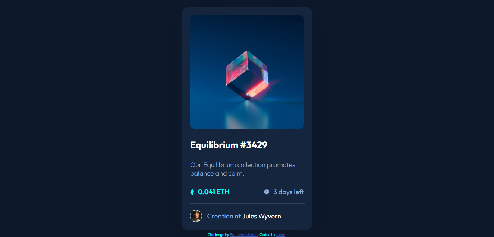

# Frontend Mentor - NFT preview card component solution

This is a solution to the [NFT preview card component challenge on Frontend Mentor](https://www.frontendmentor.io/challenges/nft-preview-card-component-SbdUL_w0U). Frontend Mentor challenges help you improve your coding skills by building realistic projects.

## Table of contents

- [Overview](#overview)
  - [The challenge](#the-challenge)
  - [Screenshot](#screenshot)
  - [Links](#links)
- [My process](#my-process)
  - [Built with](#built-with)
  - [Useful resources](#useful-resources)
- [Author](#author)

## Overview

### The challenge

Users should be able to:

- View the optimal layout depending on their device's screen size
- See hover states for interactive elements

### Screenshot

### Links

- Solution URL: [Add solution URL here](https://github.com/Trioplane/FrontEndMentor/Challenge%203/nft-preview-card-component-main/index.html)
- Live Site URL: [Add live site URL here](https://trioplane.github.io/FrontEndMentor/Challenge%203/nft-preview-card-component-main/index.html)

## My process

I planned the structure and built it on HTML, then did the styles on CSS

### Built with

- Semantic HTML5 markup
- CSS Variables
- Flexbox

### Useful resources

- [MDN Web Docs](https://developer.mozilla.org) - This website has all the elements and methods and properties you can find in HTML CSS JS, this helped me a lot since I sometimes forget how to use a thing properly

## Author

- Frontend Mentor - [@Trplnr](https://www.frontendmentor.io/profile/Trioplane)
- Twitter - [@Trplnr](https://www.twitter.com/trioplnr)
